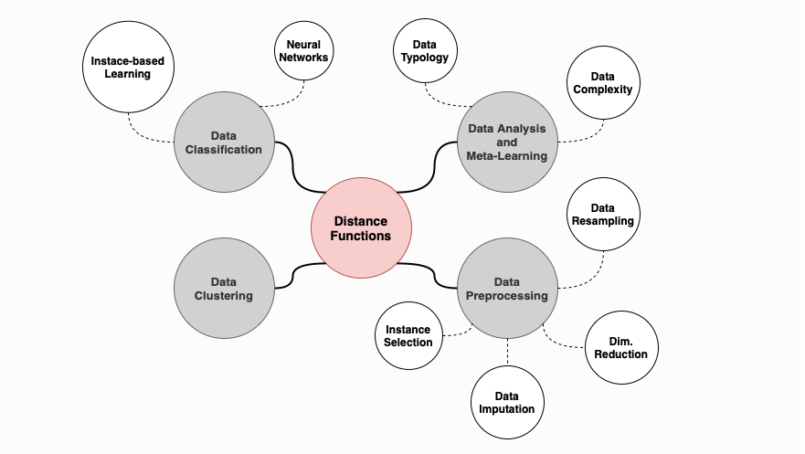

[](https://github.com/dwyl/esta/issues)

# Heterogeneous Distance Functions
The presence of heterogeneous data, comprising both continuous and categorical features, is often a challenging problem that researchers need to handle in real-world domains. Essentially, there are three main solutions for heterogeneous data:

1. **Ignore the nature of data:** This is ultimately the worst approach, as standard distance functions (e.g., Euclidean) are not universally suited to all types of data. For instance, in the case of nominal features, arithmetical operations over unordered categories are meaningless.

2. **Transform features so that they are represented on the same scale:**
    - Continuous features may be discretized to categorical. However, determining an adequate number of categories for the discretisation of continuous features is not trivial. Besides, if categories are considered nominal, the order information is lost.
    - Categorical features may be transformed to binary, using a 1/0 encoding (one-hot encoding) for each existing category (which allows arithmetic operations over values). However, one-hot encoding may significantly increase data dimensionality which adds time and memory complexity to most standard classifiers.

3. **Consider heterogeneous distance functions:** These distance functions directly handle different types of features (i.e., they do not require data transformation), thus avoiding the problems described above.


However, real-world domains are also often affected by **missing data**, i.e., absent information in datasets for which the respective values are unknown. Accordingly, there is yet another factor that needs to be accounted for in the development of heterogeneous distance functions:**the incorporation of missing data in the distance computation**. This allows that all existing information is considered for imputation, without discarding any data patterns or values. Also, it allows that the presence of missing data itself is considered in the distance computation, i.e., the uncertainty of the missing data can be accounted for: patterns comprising missing values in the same feature can either be thought to be closer (more similar) or farther from each other (less similar), or evaluated according to intermediate strategies.

**This repository comprises a set of heterogeneous distance functions (implemented in `MATLAB`) able to address complex scenarios comprising heterogeneous data – continuous and categorical (nominal and binary) features – and missing data, where the absent values themselves are incorporated in distance computation:**

- **HEOM:** Heterogeneous Euclidean-Overlap Metric
- **HVDM:** Heterogeneous Value Difference Metric 
- **HEOM-R, HVDM-R, and HVDM-S:** Redefinitions of HEOM and HVDM
- **SIMDIST:** Similarity for Heterogeneous Data
- **MDE:** Mean Euclidean Distance


## Machine Learning Applications
The distance functions comprised in this repository may be investigated across a plethora of machine learning fields operating with similarity/distance between patterns.



Below is an overview of machine learning areas relying on distance metric learning and how heterogeneous distance functions may be applied in each context:

<table>
    <thead>
        <tr>
            <th>Machine Learning Area</th>
            <th>Sub-area</th>
            <th>Methodology</th>
        </tr>
    </thead>
    <tbody>
        <tr>
            <td rowspan=2><b>Data Classification</b></td>
            <td><b>Neural Networks</b></td>
            <td>Distance functions are embedded in the operation of algorithms (e.g., radial basis functions networks, self-organising maps).</td>
        </tr>
        <tr>
            <td><b>Instance-Based Learning</b></td>
            <td>Some are referred as nearest-neighbour techniques, memory-based reasoning methods, or case-based reasoning methods. These systems use a distance function to determine the similarity between a new pattern and the training data and use the nearest instance(s) to predict the target class.</td>
        </tr>
        <tr>
            <td><b>Data Clustering</b></td>
            <td><b></b></td>
            <td>Clusters are found by identifying similar patterns. A suitable cluster solution comprises groups where its members have small distances among each other.</td>
        </tr>
        <tr>
            <td rowspan=4><b>Data Preprocessing</b></td>
            <td><b>Data Resampling</b></td>
            <td>Resampling approaches – undersampling and oversampling – use distance functions to analyse the neighbourhood of training examples and determine which patterns to clean or replicate.</td>
        </tr>
        <tr>
            <td><b>Instance Selection</b></td>
            <td>Prototype Selection and Instance Selection methods use an instance-based classifier (commonly kNN) with a distance function, to find obtain a representative subset of the original training data.</td>
        </tr>
        <tr>
            <td><b>Dimensionality Reduction</b></td>
            <td>Distance functions are used as input for well-known dimensionality reduction algorithms, such as Multidimensional Scaling (MDS) or t-distributed Stochastic Neighbour Embedding (t-SNE).</td>
        </tr>
        <tr>
            <td><b>Data Imputation</b></td>
            <td>Distance functions are used in KNN imputation as well as other imputation algorithms that operate with distances among patterns (e.g., NN, SOM, cluster-based imputation). They can also be as intermediate steps to improve other imputation approaches (e.g., via instance selection). Absent values of a given pattern are estimated using the available information of its closest neighbours.</td>
        </tr>
        <tr>
            <td rowspan=2><b>Data Analysis and Meta-Learning</b></td>
            <td><b>Data Complexity</b></td>
            <td>Distance functions are in the base of several well-established complexity measures and instance hardness estimators (e.g., N1, N2, N3, T1, LSC, CM, R-value, kDN, among others).</td>
        </tr>
        <tr>
            <td><b>Dimensionality Typology</b></td>
            <td>Depending on their local neighbourhoods, examples may be categorised into safe, borderline, rare or outlier examples. Using distinct distance functions may result in the different categorisation of examples (e.g., safe examples become borderline).</td>
        </tr>
    </tbody>
</table>


## Example of use:
The considered distance functions are implemented in the `distances` folder. The `arff-to-mat` folder contains a set of files to read `.arff` files, whereas the `data` folder contains some `.arff` files for testing.

The arguments required by distance functions are overall the following:

- `X`: matrix of data (patterns x features);
- `T`: column vector of classes;
- `feature_types`: 1/0 row vector indicating whether a feature in column i is categorical (1) or continuous (0);

Consider the `thoracic.arff` dataset provided in `data` folder, containing continuous features (PRE4, PRE5, AGE), and categorical features (the remaining), both binary and nominal.
The output distance matrix `D` returns the distances between every pair of patterns according to the HEOM distance. 

```matlab
clear all, clc
addpath('arff-to-mat');
addpath('distances');
addpath('data');

data = arff2double('thoracic.arff');
X = data.X;
T = data.Y;
feature_types = data.isNomBin;

D = heomDist(X, feature_types, 'original');
```

In such case, the argument `T` is not necessary, but it may be for other distance functions, such as HVDM.
```matlab
D = hvdmDist(X, T, feature_types, 'original');
```

Original implmentations of HEOM and HVDM are defined by the `original` parameter. Their redefinitions (HEOM-R and HVMD-R) are defined by the `redef` parameter. In the case of HVDM-S, a different function is called.
```matlab
D = heomDist(X, feature_types, 'redef'); % HEOM-R
D = hvdmDist(X, T, feature_types, 'redef'); % HVDM-R
D = hvdmSpecDist(X, T, feature_types);
```

Note that although `thoracic.arff` is originally complete (i.e., it does not contain missing data), the heterogeneous functions can also handle missing values internally.
In the following example, 20% of the dataset `X` is set to be missing completely at random (following a MCAR missing mechanism). The distance computation will be performed without the need to change any parameters in the previous code:

```matlab
% Insert MVs in X
p = 20; % percentage of missing data
X = MCAR(X, p);

D = heomDist(X, feature_types, 'original');
```

The `main.m` file contains the basic functionality to use the different heterogeneous functions. To submit bugs and feature requests, please report at the [project issues](https://github.com/miriamspsantos/heterogeneous-distance-functions/issues). 


## Citation Request:
If you plan to use this library, please consider referring to the following papers:

```
@article{Santos2020a,
  title={How distance metrics influence missing data imputation with k-nearest neighbours},
  author={Santos, Miriam Seoane and Abreu, Pedro Henriques and Wilk, Szymon and Santos, Jo{\~a}o},
  journal={Pattern Recognition Letters},
  volume={136},
  pages={111--119},
  year={2020},
  publisher={Elsevier}
}
```

```
@inproceedings{Santos2020b,
  title={Assessing the Impact of Distance Functions on K-Nearest Neighbours Imputation of Biomedical Datasets},
  author={Santos, Miriam S and Abreu, Pedro H and Wilk, Szymon and Santos, Jo{\~a}o},
  booktitle={International Conference on Artificial Intelligence in Medicine},
  pages={486--496},
  year={2020},
  organization={Springer}
}
```

## References
1. [Santos, M. S., Abreu, P. H., Wilk, S., & Santos, J. (2020). How distance metrics influence missing data imputation with k-nearest neighbours. Pattern Recognition Letters, 136, 111-119.](https://www.sciencedirect.com/science/article/pii/S0167865520302099?casa_token=TwtNIpc55jEAAAAA:2seyQe2Piif5Nrn5rcTbldUG8oL3foh7Niy0WprwQlV8JZqbWsuoxKrNBfvuwPa2IcYnuAqX)
2. [Santos, M. S., Abreu, P. H., Wilk, S., & Santos, J. (2020, August). Assessing the Impact of Distance Functions on K-Nearest Neighbours Imputation of Biomedical Datasets. In International Conference on Artificial Intelligence in Medicine (pp. 486-496). Springer, Cham.](https://link.springer.com/chapter/10.1007/978-3-030-59137-3_43)
3. [Wilson, D. R., & Martinez, T. R. (1997). Improved heterogeneous distance functions. Journal of artificial intelligence research, 6, 1-34.](https://www.jair.org/index.php/jair/article/view/10182)
4. [Juhola, M., & Laurikkala, J. (2007). On metricity of two heterogeneous measures in the presence of missing values. Artificial Intelligence Review, 28(2), 163-178.](https://link.springer.com/article/10.1007/s10462-009-9096-7)
5. [Belanche, L. A. (2012). Similarity networks for heterogeneous data. In proceedings of the 20 th European Symposium on Artificial Neural Networks (ESANN 2012).](https://citeseerx.ist.psu.edu/viewdoc/summary?doi=10.1.1.640.8542)
6. [AbdAllah, L., & Shimshoni, I. (2016, July). k-means over incomplete datasets using mean Euclidean distance. In International Conference on Machine Learning and Data Mining in Pattern Recognition (pp. 113-127). Springer, Cham.](https://link.springer.com/chapter/10.1007/978-3-319-41920-6_9)
